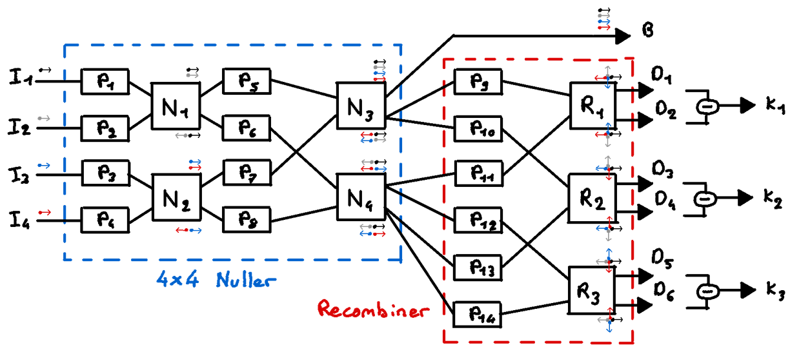

Adaptive tunable kernel-nulling interferometry for the direct detection of extrasolar planets
---

Supervised by: Frantz Martinache, David Mary & Rodolphe Krawczyk

- [🔭 Context](#-context)
- [⚙️ Current Architecture](#️-current-architecture)
- [☁️ Perturbation sources](#️-perturbation-sources)
- [🎯 Milestones](#-milestones)
  - [Milestone 1 : Analytical model](#milestone-1--analytical-model)
  - [Milestone 2 : Numerical model](#milestone-2--numerical-model)
  - [Milestone 3 : Supervised AI training](#milestone-3--supervised-ai-training)
  - [Milestone 4 : Unsupervised AI training](#milestone-4--unsupervised-ai-training)
  - [Milestone 5 : Test on the lab](#milestone-5--test-on-the-lab)

# 🔭 Context

Getting direct light from exoplanet is a hard task due to the high contrast and the low angular separation between the star and it's companion. One of the technics that already exist is called "coronography", consisting of putting a mask in the focal plane of the telescope to hide the star and let the companion appear. However, this technic is still limited by the telescope resolution and several diffraction issues. An evolution of this idea is to use an interferometer to combine the light of several telescopes, which allow to efficiently destroy the star light and significantly increase the angular resolution. This technic is called "Nulling" and have already been declined into several architectures. The architecture we are studying in this project is called the "Kernel Nulling". It consist of recombining the dark channels - those where the star light have been descrutively interfered - to create a new dark channels that have more interesting properties such as lower perturbation sensitivity or asymetrix transmission map alowing to better constraint the companion position.

This system is composed of a fiber injection system, a serie of 2x2 MMI nuller and a serie of 2x2 MMI Split&Mix - the special recombiner of our architecture - that aims to reproduce the behavior of 4 input MMI. Between each of these MMI, we placed some phase shifters to tune the behavior of the component and compensate some perturbations. The goal of this thesis is to create a method to get the best phase shifters configuration to reach the deepest nulling depth in the dark output channels.

# ⚙️ Current Architecture
The current architecture of the Kernel-Nuller component is shown in the following figure:

From left to right, we have the following components:
- $P_n$ are the delayers, they use an electrical power $p_n$ to warm up the fiber core and induce a phase shift  $\phi_{n,\lambda} = f_\lambda(p_n)$ on the input signal.
- $N_n$ are the Nulling 2x2 MMI. They make constructive interference on the first output channel and oppose the phase to make destructive interference on the second output channel.
- $S_n$ are the Split&Mix 2x2 MMI. As this system is insensitive to the global phase, we can consider that these system simply dephase one of the input by $\theta = \pi/2$ on an output channel and by $-\theta$ on the other one.

Null depths can then be computed on each of the Split&Mix output channels compared to the bright one on top of the scheme.

# ☁️ Perturbation sources

There is several perturbation sources that can affect the system. On this architecture, we only consider the phase perturbations. There is 2 mains sources of perturbations:
- Atmospheric perturbations (red) that are not correlated between the different channels and that are evolving in a milisecond time frame.
- System perturbation (blue) that are here simplified as MMI defects but actually also include the fiber lenght incertainty and the phase shifters errors. These perturbations are correlated between different channels and seems to be constant.

# 🎯 Milestones

## Milestone 1 : Analytical model

This first milestone consist of expressing the matrix associated to each component and deduce it's overall transfer function by ensuring it is physically relevant (must be energy conservative, so respect the relation $U^* U = I$)

> This step was made with the 4x4 MMI architecture so I have to redo it for this 2x2 MMI architecture.

## Milestone 2 : Numerical model

This second milestone consist of implementing this later transfer function in a numerical model and test it with and without star companion and with different levels of perturbations. The second objective in this milestone is to make a simple code that find the perfect phase shifters configuration to reach the deepest nulling depth.

> This milestone was also made with the 4x4 MMI architecture, I can easily adapt the code for the new one. However, I made a mistake in the previous numerical model consisting of summing the complex amplitude of the star and the planet which are not coherent. This correction imply to rewrite a bigger part of the code to make it indepently for the star and for the companion.

## Milestone 3 : Supervised AI training

At this point I will be able to generate a dataset using different inputs and different perturbations on which I will be able to train an AI finding the best phase shifters configuration.

This AI will firstly take in input :
- The current phase shifters configuration
- The output complex amplitudes
- The input complexe amplitudes

In a second step, I will remove the input amplitudes, and then in a third step, give to the AI only the output intensities. If this last step doesn't work because of the lack of information, I plan to add to it the input intensities.

## Milestone 4 : Unsupervised AI training

Except if the results of the milestone 3 are really satisfying, I think it could be interesting to compare the supervised method with the unsupervised one by computing a score associated to the null depth and other science information we want to get. This unsupervised method will not be limited by a dataset and all it's inherent limitations.

## Milestone 5 : Test on the lab

Once one (or both) of the previous method  gives satisfying results, I plan to test it in the lab to see how it behave in a more realistic conditions.

For the supervised method, there is a possibility to exploti a model that wwas previously trained on the numerical model and train it again on the lab data. This pre-training method is often used to reduce the amount of needed "real" data to train the model by using the numerical data to give a first intuition to the model. However, if the dataset generation is a fast process, we can still consider to train the model directly on the lab data and compare both results to see if the pre-training method is worth it or not in this highly sensitive system.
